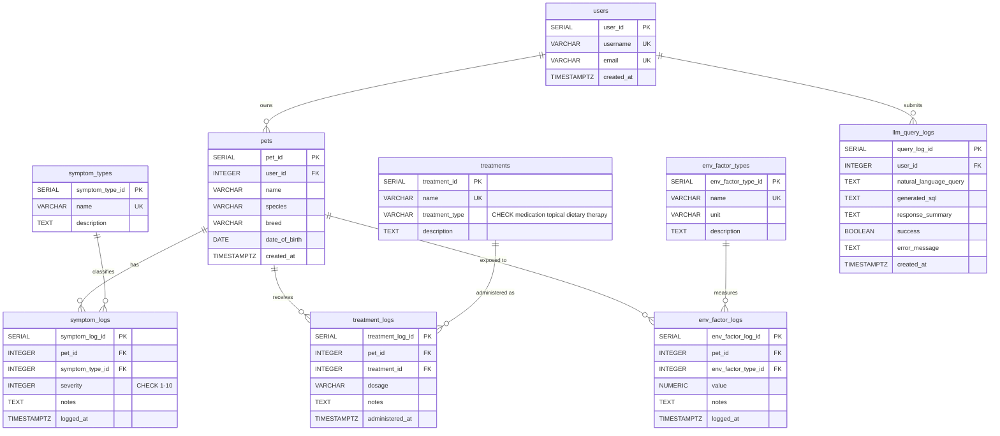

# AI-Assisted Pet Allergy Symptom Tracking System

A database-driven web application for tracking pet allergy symptoms, treatments, and environmental factors over time. Features an LLM-powered chatbot that lets users ask natural language questions about their pet's health data, which are translated into SQL queries and summarized in plain English.

Built for **CS 5600 — Advanced Database Systems** (Spring 2026) at the University of California, Merced.

---

## Table of Contents

- [Overview](#overview)
- [Tech Stack](#tech-stack)
- [Database Schema](#database-schema)
  - [Entity-Relationship Diagram](#entity-relationship-diagram)
  - [Tables](#tables)
  - [Key Design Decisions](#key-design-decisions)
- [Prerequisites](#prerequisites)
- [Setup Instructions](#setup-instructions)
  - [1. Install PostgreSQL](#1-install-postgresql)
  - [2. Create the Database](#2-create-the-database)
  - [3. Install Ollama (LLM)](#3-install-ollama-llm)
  - [4. Build and Run the Application](#4-build-and-run-the-application)
- [Using the Application](#using-the-application)
- [Project Structure](#project-structure)
- [Configuration](#configuration)

---

## Overview

This application allows pet owners to:

- **Manage pets** — Add and view pets with species, breed, and date of birth.
- **Log symptoms** — Record allergy symptoms (itching, sneezing, skin redness, etc.) with severity ratings (1-10) and timestamps.
- **Log treatments** — Track medications and therapies (Apoquel, Cytopoint, medicated shampoo, etc.) with dosage and timestamps.
- **Log environmental factors** — Record pollen counts, temperature, humidity, and mold spore levels.
- **Dashboard** — View summary statistics, severity trends, and recent activity at a glance.
- **AI Chat** — Ask natural language questions like "What are Finn's most common symptoms?" or "Is there a correlation between pollen and itching?" The LLM generates SQL, executes it against the database, and returns a plain-English summary with the raw data.

The database schema is fully normalized to BCNF with 9 tables, composite indexes on primary query patterns, and proper foreign key constraints with CASCADE/RESTRICT policies.

---

## Tech Stack

| Layer | Technology | Version |
|---|---|---|
| Database | PostgreSQL | 15+ |
| Backend | Java + Javalin + JDBC + HikariCP | Java 17, Javalin 6.7.0, HikariCP 5.1.0 |
| Frontend | HTML + Vanilla JavaScript + Tailwind CSS (CDN) | No build step required |
| LLM | Ollama (Llama 3.2, local) | REST API at localhost:11434 |
| Build | Apache Maven (Shade plugin for fat JAR) | 3.9+ |

---

## Database Schema

### Entity-Relationship Diagram



### Tables

9 tables in BCNF-normalized form:

| Table | Purpose |
|---|---|
| `users` | Application users (auth not implemented, default user seeded) |
| `pets` | Pets belonging to users |
| `symptom_types` | Reference table for symptom categories |
| `symptom_logs` | Timestamped symptom entries with severity (1-10) |
| `treatments` | Reference table for medications/therapies |
| `treatment_logs` | Timestamped treatment administration records |
| `env_factor_types` | Reference table for environmental factor categories |
| `env_factor_logs` | Timestamped environmental readings |
| `llm_query_logs` | Audit log of all AI chat queries and generated SQL |

### Key Design Decisions

- `TIMESTAMPTZ` used throughout (stores UTC internally, avoids timezone bugs)
- Composite indexes on `(pet_id, timestamp)` for the primary query pattern
- `ON DELETE CASCADE` on pet log tables; `RESTRICT` on treatment references to preserve history
- Type names normalized into reference tables to eliminate update anomalies

The full DDL is in [`backend/src/main/resources/db/schema.sql`](backend/src/main/resources/db/schema.sql).

---

## Prerequisites

Before running the application, ensure you have the following installed:

1. **Java 17+** — [Download from Adoptium](https://adoptium.net/)
   ```bash
   java -version
   ```

2. **Apache Maven 3.9+** — [Download from Maven](https://maven.apache.org/download.cgi)
   ```bash
   mvn -version
   ```

3. **PostgreSQL 15+** — [Download from PostgreSQL](https://www.postgresql.org/download/)
   ```bash
   psql --version
   ```

4. **Ollama** (for AI Chat feature) — [Download from Ollama](https://ollama.com/download)
   ```bash
   ollama --version
   ```

---

## Setup Instructions

### 1. Install PostgreSQL

**Windows:**
1. Download the installer from [postgresql.org/download/windows](https://www.postgresql.org/download/windows/).
2. Run the installer — use the default port `5432` and set the password for the `postgres` user to `postgres`.
3. Add PostgreSQL to your PATH:
   ```
   set PATH=%PATH%;C:\Program Files\PostgreSQL\17\bin
   ```

**macOS:**
```bash
brew install postgresql@17
brew services start postgresql@17
```

**Linux:**
```bash
sudo apt update && sudo apt install postgresql postgresql-contrib
sudo systemctl start postgresql
```

### 2. Create the Database

Open a terminal and run:

```bash
createdb -U postgres pet_allergy_tracker
```

If prompted for a password, enter `postgres` (or whatever you set during installation).

> The application will automatically create all tables and seed sample data on first startup. No need to run SQL files manually.

### 3. Install Ollama (LLM)

The AI Chat feature requires Ollama running locally.

1. Download and install Ollama from [ollama.com/download](https://ollama.com/download).
2. Pull the model:
   ```bash
   ollama pull llama3.2
   ```
3. Verify Ollama is running:
   ```bash
   ollama list
   ```
   You should see `llama3.2` in the output.

> Ollama runs in the background automatically after installation. The AI Chat feature will show a "service unavailable" message if Ollama is not running, but the rest of the application works without it.

### 4. Build and Run the Application

```bash
cd backend
mvn clean package -q
java -jar target/pet-allergy-tracker-1.0-SNAPSHOT.jar
```

The application starts on **http://localhost:7070**.

On first startup, the application will:
- Connect to PostgreSQL and create all 9 tables via `schema.sql`
- Load 60 days of realistic sample data via `seed.sql` (a Golden Retriever named Finn with allergy history)
- Begin serving the web interface and REST API

---

## Using the Application

Open **http://localhost:7070** in your browser.

### Pages

| Page | URL | Description |
|---|---|---|
| Dashboard | `/` | Summary cards, severity trends, top symptoms chart, recent activity |
| Pets | `/pets.html` | View and add pets |
| Pet Detail | `/pet-detail.html?petId=1` | Log symptoms, treatments, and environmental factors for a pet |
| AI Chat | `/chat.html` | Ask natural language questions about pet health data |

### Sample AI Chat Questions

- "What are Finn's most common symptoms?"
- "Show average severity by month"
- "Which treatments helped reduce itching?"
- "Is there a correlation between pollen and symptoms?"
- "How is Finn doing today?"

---

## Project Structure

```
project-root/
├── README.md
├── backend/
│   ├── pom.xml                              # Maven build config
│   └── src/main/
│       ├── java/com/petallergy/
│       │   ├── App.java                     # Entry point, Javalin config, route registration
│       │   ├── config/
│       │   │   └── DatabaseConfig.java      # HikariCP DataSource + schema/seed init
│       │   ├── model/                       # 9 POJOs (one per table)
│       │   ├── dao/                         # 9 DAOs, raw SQL via PreparedStatement
│       │   ├── controller/                  # 5 REST controllers
│       │   │   ├── PetController.java
│       │   │   ├── SymptomController.java
│       │   │   ├── TreatmentController.java
│       │   │   ├── EnvFactorController.java
│       │   │   └── ChatController.java
│       │   └── service/
│       │       └── OllamaService.java       # LLM integration (prompt, SQL gen, execution)
│       └── resources/
│           ├── public/                      # Static frontend (served by Javalin)
│           │   ├── index.html               # Dashboard
│           │   ├── pets.html                # Pet management
│           │   ├── pet-detail.html          # Single pet view with logging
│           │   ├── chat.html                # AI chatbot
│           │   ├── css/app.css
│           │   ├── img/logo.png
│           │   └── js/
│           │       ├── api.js               # Shared fetch wrapper + utilities
│           │       ├── dashboard.js
│           │       ├── pets.js
│           │       ├── pet-detail.js
│           │       └── chat.js
│           ├── db/
│           │   ├── schema.sql               # Full DDL (9 tables, indexes, constraints)
│           │   └── seed.sql                 # 60 days of sample data
│           └── logback.xml
└── docs/                                    # Project documents
```

---

## Configuration

The application uses environment variables with sensible defaults. No configuration changes are needed for local development.

| Variable | Default | Description |
|---|---|---|
| `DB_URL` | `jdbc:postgresql://localhost:5432/pet_allergy_tracker` | PostgreSQL JDBC connection URL |
| `DB_USER` | `postgres` | Database username |
| `DB_PASSWORD` | `postgres` | Database password |

To override (e.g., different password):

```bash
DB_PASSWORD=mypassword java -jar target/pet-allergy-tracker-1.0-SNAPSHOT.jar
```

The Ollama endpoint is configured at `http://localhost:11434` (Ollama's default) and the LLM model is `llama3.2`.
